# Class: AiSystem

_A compound AI System composed of one or more AI capablities. ChatGPT is an example of an AI system which deploys multiple GPT AI models._

URI: [airo:AISystem](https://w3id.org/airo#AISystem)

```mermaid
 classDiagram
    class AiSystem
    click AiSystem href "../AiSystem/"
      BaseAi <|-- AiSystem
        click BaseAi href "../BaseAi/"
      Entry <|-- AiSystem
        click Entry href "../Entry/"


      AiSystem <|-- AiAgent
        click AiAgent href "../AiAgent/"


      AiSystem : broad_mappings





        AiSystem --> "*" Any : broad_mappings
        click Any href "../Any/"



      AiSystem : close_mappings





        AiSystem --> "*" Any : close_mappings
        click Any href "../Any/"



      AiSystem : dateCreated

      AiSystem : dateModified

      AiSystem : description

      AiSystem : exact_mappings





        AiSystem --> "*" Any : exact_mappings
        click Any href "../Any/"



      AiSystem : hasAISubject





        AiSystem --> "0..1" AISubject : hasAISubject
        click AISubject href "../AISubject/"



      AiSystem : hasAIUser

      AiSystem : hasCapability





        AiSystem --> "*" Capability : hasCapability
        click Capability href "../Capability/"



      AiSystem : hasDocumentation





        AiSystem --> "*" Documentation : hasDocumentation
        click Documentation href "../Documentation/"



      AiSystem : hasEuAiSystemType





        AiSystem --> "0..1" AiSystemType : hasEuAiSystemType
        click AiSystemType href "../AiSystemType/"



      AiSystem : hasEuRiskCategory





        AiSystem --> "0..1" EuAiRiskCategory : hasEuRiskCategory
        click EuAiRiskCategory href "../EuAiRiskCategory/"



      AiSystem : hasLicense





        AiSystem --> "0..1" License : hasLicense
        click License href "../License/"



      AiSystem : hasModelCard

      AiSystem : hasPurpose





        AiSystem --> "0..1" Purpose : hasPurpose
        click Purpose href "../Purpose/"



      AiSystem : hasRelatedRisk





        AiSystem --> "*" Risk : hasRelatedRisk
        click Risk href "../Risk/"



      AiSystem : hasStakeholder





        AiSystem --> "0..1" Stakeholder : hasStakeholder
        click Stakeholder href "../Stakeholder/"



      AiSystem : id

      AiSystem : implementedByAdapter





        AiSystem --> "*" Adapter : implementedByAdapter
        click Adapter href "../Adapter/"



      AiSystem : isAppliedWithinDomain





        AiSystem --> "*" Domain : isAppliedWithinDomain
        click Domain href "../Domain/"



      AiSystem : isComposedOf





        AiSystem --> "*" BaseAi : isComposedOf
        click BaseAi href "../BaseAi/"



      AiSystem : isDefinedByTaxonomy





        AiSystem --> "0..1" Taxonomy : isDefinedByTaxonomy
        click Taxonomy href "../Taxonomy/"



      AiSystem : isDefinedByVocabulary





        AiSystem --> "0..1" Vocabulary : isDefinedByVocabulary
        click Vocabulary href "../Vocabulary/"



      AiSystem : isDeployedBy





        AiSystem --> "0..1" AIDeployer : isDeployedBy
        click AIDeployer href "../AIDeployer/"



      AiSystem : isDevelopedBy





        AiSystem --> "0..1" AIDeveloper : isDevelopedBy
        click AIDeveloper href "../AIDeveloper/"



      AiSystem : isPartOf

      AiSystem : isProvidedBy





        AiSystem --> "0..1" AiProvider : isProvidedBy
        click AiProvider href "../AiProvider/"



      AiSystem : isUsedWithinLocality





        AiSystem --> "*" LocalityOfUse : isUsedWithinLocality
        click LocalityOfUse href "../LocalityOfUse/"



      AiSystem : name

      AiSystem : narrow_mappings





        AiSystem --> "*" Any : narrow_mappings
        click Any href "../Any/"



      AiSystem : performsTask





        AiSystem --> "*" AiTask : performsTask
        click AiTask href "../AiTask/"



      AiSystem : producer





        AiSystem --> "0..1" Organization : producer
        click Organization href "../Organization/"



      AiSystem : related_mappings





        AiSystem --> "*" Any : related_mappings
        click Any href "../Any/"



      AiSystem : requiredByTask





        AiSystem --> "*" AiTask : requiredByTask
        click AiTask href "../AiTask/"



      AiSystem : requiresCapability





        AiSystem --> "*" Capability : requiresCapability
        click Capability href "../Capability/"



      AiSystem : type

      AiSystem : url


```



## Inheritance

- [Entity](Entity.md)
  - [Entry](Entry.md)
    - **AiSystem** [ [BaseAi](BaseAi.md)]
      - [AiAgent](AiAgent.md)

## Slots

| Name                                              | Cardinality and Range                                                                                        | Description                                                                      | Inheritance                            |
| ------------------------------------------------- | ------------------------------------------------------------------------------------------------------------ | -------------------------------------------------------------------------------- | -------------------------------------- |
| [isComposedOf](isComposedOf.md)                   | \* <br/> [BaseAi](BaseAi.md)                                                                                 | Relationship indicating the AI components from which a complete AI system is ... | direct                                 |
| [hasEuAiSystemType](hasEuAiSystemType.md)         | 0..1 <br/> [AiSystemType](AiSystemType.md)                                                                   | The type of system as defined by the EU AI Act                                   | direct                                 |
| [hasEuRiskCategory](hasEuRiskCategory.md)         | 0..1 <br/> [EuAiRiskCategory](EuAiRiskCategory.md)                                                           | The risk category of an AI system as defined by the EU AI Act                    | direct                                 |
| [hasCapability](hasCapability.md)                 | \* <br/> [Capability](Capability.md)                                                                         | Indicates the technical capabilities this entry possesses                        | direct                                 |
| [isAppliedWithinDomain](isAppliedWithinDomain.md) | \* <br/> [Domain](Domain.md)                                                                                 | Specifies the domain an AI system is used within                                 | direct                                 |
| [isUsedWithinLocality](isUsedWithinLocality.md)   | \* <br/> [LocalityOfUse](LocalityOfUse.md)                                                                   | Specifies the domain an AI system is used within                                 | direct                                 |
| [hasPurpose](hasPurpose.md)                       | 0..1 <br/> [Purpose](Purpose.md)                                                                             | Indicates the purpose of an entity, e                                            | direct                                 |
| [hasStakeholder](hasStakeholder.md)               | 0..1 <br/> [Stakeholder](Stakeholder.md)                                                                     | Indicates stakeholders of an AI system or component                              | direct                                 |
| [isDeployedBy](isDeployedBy.md)                   | 0..1 <br/> [AIDeployer](AIDeployer.md)                                                                       | Indicates the deployer of an AI system or component                              | direct                                 |
| [isDevelopedBy](isDevelopedBy.md)                 | 0..1 <br/> [AIDeveloper](AIDeveloper.md)                                                                     | Indicates the developer of an AI system or component                             | direct                                 |
| [hasAISubject](hasAISubject.md)                   | 0..1 <br/> [AISubject](AISubject.md)                                                                         | Indicates the subjects of an AI system                                           | direct                                 |
| [hasAIUser](hasAIUser.md)                         | 0..1 <br/> [String](String.md)                                                                               | Indicate the end-user of an AI system                                            | direct                                 |
| [hasRelatedRisk](hasRelatedRisk.md)               | \* <br/> [Risk](Risk.md)&nbsp;or&nbsp;<br />[RiskConcept](RiskConcept.md)&nbsp;or&nbsp;<br />[Term](Term.md) | A relationship where an entity relates to a risk                                 | direct                                 |
| [producer](producer.md)                           | 0..1 <br/> [Organization](Organization.md)                                                                   | A relationship to the Organization instance which produces this instance         | [BaseAi](BaseAi.md)                    |
| [hasModelCard](hasModelCard.md)                   | \* <br/> [String](String.md)                                                                                 | A relationship to model card references                                          | [BaseAi](BaseAi.md)                    |
| [hasDocumentation](hasDocumentation.md)           | \* <br/> [Documentation](Documentation.md)                                                                   | Indicates documentation associated with an entity                                | [Entry](Entry.md), [BaseAi](BaseAi.md) |
| [hasLicense](hasLicense.md)                       | 0..1 <br/> [License](License.md)                                                                             | Indicates licenses associated with a resource                                    | [BaseAi](BaseAi.md)                    |
| [performsTask](performsTask.md)                   | \* <br/> [AiTask](AiTask.md)                                                                                 | relationship indicating the AI tasks an AI model can perform                     | [BaseAi](BaseAi.md)                    |
| [isProvidedBy](isProvidedBy.md)                   | 0..1 <br/> [AiProvider](AiProvider.md)                                                                       | Indicates provider of an AI system or component                                  | [BaseAi](BaseAi.md)                    |
| [isDefinedByTaxonomy](isDefinedByTaxonomy.md)     | 0..1 <br/> [Taxonomy](Taxonomy.md)                                                                           | A relationship where a concept or a concept group is defined by a taxonomy       | [Entry](Entry.md)                      |
| [isDefinedByVocabulary](isDefinedByVocabulary.md) | 0..1 <br/> [Vocabulary](Vocabulary.md)                                                                       | A relationship where a term or a term group is defined by a vocabulary           | [Entry](Entry.md)                      |
| [isPartOf](isPartOf.md)                           | 0..1 <br/> [String](String.md)                                                                               | A relationship where an entity is part of another entity                         | [Entry](Entry.md)                      |
| [requiredByTask](requiredByTask.md)               | \* <br/> [AiTask](AiTask.md)                                                                                 | Indicates that this entry is required to perform a specific AI task              | [Entry](Entry.md)                      |
| [requiresCapability](requiresCapability.md)       | \* <br/> [Capability](Capability.md)                                                                         | Indicates that this entry requires a specific capability                         | [Entry](Entry.md)                      |
| [implementedByAdapter](implementedByAdapter.md)   | \* <br/> [Adapter](Adapter.md)                                                                               | Indicates that this capability is implemented by a specific adapter              | [Entry](Entry.md)                      |
| [type](type.md)                                   | 0..1 <br/> [String](String.md)                                                                               | The entry type                                                                   | [Entry](Entry.md)                      |
| [id](id.md)                                       | 1 <br/> [String](String.md)                                                                                  | A unique identifier to this instance of the model element                        | [Entity](Entity.md)                    |
| [name](name.md)                                   | 0..1 <br/> [String](String.md)                                                                               | A text name of this instance                                                     | [Entity](Entity.md)                    |
| [description](description.md)                     | 0..1 <br/> [String](String.md)                                                                               | The description of an entity                                                     | [Entity](Entity.md)                    |
| [url](url.md)                                     | 0..1 <br/> [Uri](Uri.md)                                                                                     | An optional URL associated with this instance                                    | [Entity](Entity.md)                    |
| [dateCreated](dateCreated.md)                     | 0..1 <br/> [Date](Date.md)                                                                                   | The date on which the entity was created                                         | [Entity](Entity.md)                    |
| [dateModified](dateModified.md)                   | 0..1 <br/> [Date](Date.md)                                                                                   | The date on which the entity was most recently modified                          | [Entity](Entity.md)                    |
| [exact_mappings](exact_mappings.md)               | \* <br/> [Any](Any.md)                                                                                       | The property is used to link two concepts, indicating a high degree of confid... | [Entity](Entity.md)                    |
| [close_mappings](close_mappings.md)               | \* <br/> [Any](Any.md)                                                                                       | The property is used to link two concepts that are sufficiently similar that ... | [Entity](Entity.md)                    |
| [related_mappings](related_mappings.md)           | \* <br/> [Any](Any.md)                                                                                       | The property skos:relatedMatch is used to state an associative mapping link b... | [Entity](Entity.md)                    |
| [narrow_mappings](narrow_mappings.md)             | \* <br/> [Any](Any.md)                                                                                       | The property is used to state a hierarchical mapping link between two concept... | [Entity](Entity.md)                    |
| [broad_mappings](broad_mappings.md)               | \* <br/> [Any](Any.md)                                                                                       | The property is used to state a hierarchical mapping link between two concept... | [Entity](Entity.md)                    |

## Mixin Usage

| mixed into | description |
| ---------- | ----------- |

## Identifier and Mapping Information

### Schema Source

- from schema: https://ibm.github.io/ai-atlas-nexus/ontology/ai-risk-ontology

## Mappings

| Mapping Type | Mapped Value   |
| ------------ | -------------- |
| self         | airo:AISystem  |
| native       | nexus:AiSystem |

## LinkML Source

<!-- TODO: investigate https://stackoverflow.com/questions/37606292/how-to-create-tabbed-code-blocks-in-mkdocs-or-sphinx -->

### Direct

<details>
```yaml
name: AiSystem
description: A compound AI System composed of one or more AI capablities. ChatGPT
  is an example of an AI system which deploys multiple GPT AI models.
from_schema: https://ibm.github.io/ai-atlas-nexus/ontology/ai-risk-ontology
is_a: Entry
mixin: true
mixins:
- BaseAi
slots:
- isComposedOf
- hasEuAiSystemType
- hasEuRiskCategory
- hasCapability
- isAppliedWithinDomain
- isUsedWithinLocality
- hasPurpose
- hasStakeholder
- isDeployedBy
- isDevelopedBy
- hasAISubject
- hasAIUser
- hasRelatedRisk
slot_usage:
  isComposedOf:
    name: isComposedOf
    description: Relationship indicating the AI components from which a complete AI
      system is composed.
    range: BaseAi
class_uri: airo:AISystem

````
</details>

### Induced

<details>
```yaml
name: AiSystem
description: A compound AI System composed of one or more AI capablities. ChatGPT
  is an example of an AI system which deploys multiple GPT AI models.
from_schema: https://ibm.github.io/ai-atlas-nexus/ontology/ai-risk-ontology
is_a: Entry
mixin: true
mixins:
- BaseAi
slot_usage:
  isComposedOf:
    name: isComposedOf
    description: Relationship indicating the AI components from which a complete AI
      system is composed.
    range: BaseAi
attributes:
  isComposedOf:
    name: isComposedOf
    description: Relationship indicating the AI components from which a complete AI
      system is composed.
    from_schema: https://ibm.github.io/ai-atlas-nexus/ontology/ai-risk-ontology
    rank: 1000
    alias: isComposedOf
    owner: AiSystem
    domain_of:
    - AiSystem
    range: BaseAi
    multivalued: true
    inlined: false
  hasEuAiSystemType:
    name: hasEuAiSystemType
    description: The type of system as defined by the EU AI Act.
    from_schema: https://ibm.github.io/ai-atlas-nexus/ontology/ai-risk-ontology
    rank: 1000
    alias: hasEuAiSystemType
    owner: AiSystem
    domain_of:
    - AiSystem
    range: AiSystemType
  hasEuRiskCategory:
    name: hasEuRiskCategory
    description: The risk category of an AI system as defined by the EU AI Act.
    from_schema: https://ibm.github.io/ai-atlas-nexus/ontology/ai-risk-ontology
    rank: 1000
    alias: hasEuRiskCategory
    owner: AiSystem
    domain_of:
    - AiSystem
    range: EuAiRiskCategory
  hasCapability:
    name: hasCapability
    description: 'Indicates the technical capabilities this entry possesses.

      '
    from_schema: https://ibm.github.io/ai-atlas-nexus/ontology/ai-risk-ontology
    rank: 1000
    slot_uri: tech:hasCapability
    alias: hasCapability
    owner: AiSystem
    domain_of:
    - AiSystem
    - Adapter
    - LLMIntrinsic
    range: Capability
    multivalued: true
    inlined: false
  isAppliedWithinDomain:
    name: isAppliedWithinDomain
    description: Specifies the domain an AI system is used within.
    from_schema: https://ibm.github.io/ai-atlas-nexus/ontology/ai-risk-ontology
    rank: 1000
    domain: '[''AISystem'', ''AIComponent'']'
    slot_uri: airo:isAppliedWithinDomain
    alias: isAppliedWithinDomain
    owner: AiSystem
    domain_of:
    - AiSystem
    range: Domain
    multivalued: true
    inlined: false
  isUsedWithinLocality:
    name: isUsedWithinLocality
    description: Specifies the domain an AI system is used within.
    from_schema: https://ibm.github.io/ai-atlas-nexus/ontology/ai-risk-ontology
    rank: 1000
    domain: '[''AISystem'', ''AIComponent'']'
    slot_uri: airo:isUsedWithinLocality
    alias: isUsedWithinLocality
    owner: AiSystem
    domain_of:
    - AiSystem
    range: LocalityOfUse
    multivalued: true
    inlined: false
  hasPurpose:
    name: hasPurpose
    description: Indicates the purpose of an entity, e.g. AI system, components.
    from_schema: https://ibm.github.io/ai-atlas-nexus/ontology/ai-risk-ontology
    rank: 1000
    slot_uri: airo:hasPurpose
    alias: hasPurpose
    owner: AiSystem
    domain_of:
    - AiSystem
    range: Purpose
  hasStakeholder:
    name: hasStakeholder
    description: Indicates stakeholders of an AI system or component.
    from_schema: https://ibm.github.io/ai-atlas-nexus/ontology/ai-risk-ontology
    rank: 1000
    domain: '[''airo:AISystem'', ''airo:AIComponent'']'
    slot_uri: airo:hasStakeholder
    alias: hasStakeholder
    owner: AiSystem
    domain_of:
    - AiSystem
    range: Stakeholder
  isDeployedBy:
    name: isDeployedBy
    description: Indicates the deployer of an AI system or component.
    from_schema: https://ibm.github.io/ai-atlas-nexus/ontology/ai-risk-ontology
    rank: 1000
    domain: '[''AISystem'', ''AIComponent'']'
    slot_uri: airo:isDeployedBy
    alias: isDeployedBy
    owner: AiSystem
    domain_of:
    - AiSystem
    range: AIDeployer
  isDevelopedBy:
    name: isDevelopedBy
    description: Indicates the developer of an AI system or component.
    from_schema: https://ibm.github.io/ai-atlas-nexus/ontology/ai-risk-ontology
    rank: 1000
    domain: '[''AISystem'', ''AIComponent'']'
    slot_uri: airo:isDevelopedBy
    alias: isDevelopedBy
    owner: AiSystem
    domain_of:
    - AiSystem
    range: AIDeveloper
  hasAISubject:
    name: hasAISubject
    description: Indicates the subjects of an AI system
    from_schema: https://ibm.github.io/ai-atlas-nexus/ontology/ai-risk-ontology
    rank: 1000
    domain: '[''airo:AISystem'']'
    slot_uri: airo:hasAISubject
    alias: hasAISubject
    owner: AiSystem
    domain_of:
    - AiSystem
    range: AISubject
  hasAIUser:
    name: hasAIUser
    description: Indicate the end-user of an AI system.
    from_schema: https://ibm.github.io/ai-atlas-nexus/ontology/ai-risk-ontology
    rank: 1000
    domain: AISystem
    slot_uri: airo:hasAiUser
    alias: hasAIUser
    owner: AiSystem
    domain_of:
    - AiSystem
    range: string
  hasRelatedRisk:
    name: hasRelatedRisk
    description: A relationship where an entity relates to a risk
    from_schema: https://ibm.github.io/ai-atlas-nexus/ontology/ai-risk-ontology
    rank: 1000
    domain: Any
    alias: hasRelatedRisk
    owner: AiSystem
    domain_of:
    - Term
    - LLMQuestionPolicy
    - Action
    - AiSystem
    - AiEval
    - BenchmarkMetadataCard
    - Adapter
    - LLMIntrinsic
    range: Risk
    multivalued: true
    inlined: false
    any_of:
    - range: RiskConcept
    - range: Term
  producer:
    name: producer
    description: A relationship to the Organization instance which produces this instance.
    from_schema: https://ibm.github.io/ai-atlas-nexus/ontology/ai-risk-ontology
    rank: 1000
    alias: producer
    owner: AiSystem
    domain_of:
    - BaseAi
    range: Organization
  hasModelCard:
    name: hasModelCard
    description: A relationship to model card references.
    from_schema: https://ibm.github.io/ai-atlas-nexus/ontology/ai-risk-ontology
    rank: 1000
    alias: hasModelCard
    owner: AiSystem
    domain_of:
    - BaseAi
    range: string
    multivalued: true
    inlined: true
    inlined_as_list: true
  hasDocumentation:
    name: hasDocumentation
    description: Indicates documentation associated with an entity.
    from_schema: https://ibm.github.io/ai-atlas-nexus/ontology/ai-risk-ontology
    rank: 1000
    slot_uri: airo:hasDocumentation
    alias: hasDocumentation
    owner: AiSystem
    domain_of:
    - Dataset
    - Vocabulary
    - Taxonomy
    - Concept
    - Group
    - Entry
    - Term
    - Principle
    - RiskTaxonomy
    - Action
    - BaseAi
    - LargeLanguageModelFamily
    - AiEval
    - BenchmarkMetadataCard
    - Adapter
    - LLMIntrinsic
    range: Documentation
    multivalued: true
    inlined: false
  hasLicense:
    name: hasLicense
    description: Indicates licenses associated with a resource
    from_schema: https://ibm.github.io/ai-atlas-nexus/ontology/ai-risk-ontology
    rank: 1000
    slot_uri: airo:hasLicense
    alias: hasLicense
    owner: AiSystem
    domain_of:
    - Dataset
    - Documentation
    - Vocabulary
    - Taxonomy
    - RiskTaxonomy
    - BaseAi
    - AiEval
    - BenchmarkMetadataCard
    - Adapter
    range: License
  performsTask:
    name: performsTask
    description: relationship indicating the AI tasks an AI model can perform.
    from_schema: https://ibm.github.io/ai-atlas-nexus/ontology/ai-risk-ontology
    rank: 1000
    alias: performsTask
    owner: AiSystem
    domain_of:
    - BaseAi
    range: AiTask
    multivalued: true
    inlined: false
  isProvidedBy:
    name: isProvidedBy
    description: Indicates provider of an AI system or component.
    from_schema: https://ibm.github.io/ai-atlas-nexus/ontology/ai-risk-ontology
    rank: 1000
    slot_uri: airo:isProvidedBy
    alias: isProvidedBy
    owner: AiSystem
    domain_of:
    - BaseAi
    range: AiProvider
  isDefinedByTaxonomy:
    name: isDefinedByTaxonomy
    description: A relationship where a concept or a concept group is defined by a
      taxonomy
    from_schema: https://ibm.github.io/ai-atlas-nexus/ontology/ai-risk-ontology
    rank: 1000
    slot_uri: schema:isPartOf
    alias: isDefinedByTaxonomy
    owner: AiSystem
    domain_of:
    - Concept
    - Control
    - Group
    - Entry
    - Policy
    - Rule
    - RiskGroup
    - Risk
    - RiskControl
    - Action
    - RiskIncident
    - Stakeholder
    - StakeholderGroup
    - CapabilityGroup
    - Requirement
    range: Taxonomy
  isDefinedByVocabulary:
    name: isDefinedByVocabulary
    description: A relationship where a term or a term group is defined by a vocabulary
    from_schema: https://ibm.github.io/ai-atlas-nexus/ontology/ai-risk-ontology
    rank: 1000
    slot_uri: schema:isPartOf
    alias: isDefinedByVocabulary
    owner: AiSystem
    domain_of:
    - Entry
    - Term
    - Adapter
    - LLMIntrinsic
    range: Vocabulary
  isPartOf:
    name: isPartOf
    description: A relationship where an entity is part of another entity
    from_schema: https://ibm.github.io/ai-atlas-nexus/ontology/ai-risk-ontology
    rank: 1000
    slot_uri: schema:isPartOf
    alias: isPartOf
    owner: AiSystem
    domain_of:
    - Entry
    - Risk
    - LargeLanguageModel
    - Stakeholder
    - CapabilityGroup
    range: string
  requiredByTask:
    name: requiredByTask
    description: Indicates that this entry is required to perform a specific AI task.
    from_schema: https://ibm.github.io/ai-atlas-nexus/ontology/ai-risk-ontology
    rank: 1000
    alias: requiredByTask
    owner: AiSystem
    domain_of:
    - Entry
    - Capability
    inverse: requiresCapability
    range: AiTask
    multivalued: true
    inlined: false
  requiresCapability:
    name: requiresCapability
    description: Indicates that this entry requires a specific capability
    from_schema: https://ibm.github.io/ai-atlas-nexus/ontology/ai-risk-ontology
    rank: 1000
    domain: Any
    alias: requiresCapability
    owner: AiSystem
    domain_of:
    - Entry
    - LargeLanguageModel
    - AiTask
    - Adapter
    inverse: requiredByTask
    range: Capability
    multivalued: true
    inlined: false
  implementedByAdapter:
    name: implementedByAdapter
    description: 'Indicates that this capability is implemented by a specific adapter.
      This relationship distinguishes the abstract capability (what can be done) from
      the technical implementation mechanism (how it is added/extended via adapters).

      '
    from_schema: https://ibm.github.io/ai-atlas-nexus/ontology/ai-risk-ontology
    rank: 1000
    domain: Any
    alias: implementedByAdapter
    owner: AiSystem
    domain_of:
    - Entry
    - Capability
    inverse: implementsCapability
    range: Adapter
    multivalued: true
    inlined: false
  type:
    name: type
    description: The entry type.
    from_schema: https://ibm.github.io/ai-atlas-nexus/ontology/common
    designates_type: true
    alias: type
    owner: AiSystem
    domain_of:
    - Vocabulary
    - Taxonomy
    - Concept
    - Control
    - Group
    - Entry
    - Policy
    - Rule
    - Permission
    - Prohibition
    - Obligation
    - Recommendation
    - Certification
    - ControlActivity
    - ControlActivityPermission
    - ControlActivityProhibition
    - ControlActivityObligation
    - ControlActivityRecommendation
    - Requirement
    range: string
  id:
    name: id
    description: A unique identifier to this instance of the model element. Example
      identifiers include UUID, URI, URN, etc.
    from_schema: https://ibm.github.io/ai-atlas-nexus/ontology/ai-risk-ontology
    rank: 1000
    slot_uri: schema:identifier
    identifier: true
    alias: id
    owner: AiSystem
    domain_of:
    - Entity
    range: string
    required: true
  name:
    name: name
    description: A text name of this instance.
    from_schema: https://ibm.github.io/ai-atlas-nexus/ontology/ai-risk-ontology
    rank: 1000
    slot_uri: schema:name
    alias: name
    owner: AiSystem
    domain_of:
    - Entity
    - BenchmarkMetadataCard
    range: string
  description:
    name: description
    description: The description of an entity
    from_schema: https://ibm.github.io/ai-atlas-nexus/ontology/ai-risk-ontology
    rank: 1000
    slot_uri: schema:description
    alias: description
    owner: AiSystem
    domain_of:
    - Entity
    range: string
  url:
    name: url
    description: An optional URL associated with this instance.
    from_schema: https://ibm.github.io/ai-atlas-nexus/ontology/ai-risk-ontology
    rank: 1000
    slot_uri: schema:url
    alias: url
    owner: AiSystem
    domain_of:
    - Entity
    range: uri
  dateCreated:
    name: dateCreated
    description: The date on which the entity was created.
    from_schema: https://ibm.github.io/ai-atlas-nexus/ontology/ai-risk-ontology
    rank: 1000
    slot_uri: schema:dateCreated
    alias: dateCreated
    owner: AiSystem
    domain_of:
    - Entity
    range: date
    required: false
  dateModified:
    name: dateModified
    description: The date on which the entity was most recently modified.
    from_schema: https://ibm.github.io/ai-atlas-nexus/ontology/ai-risk-ontology
    rank: 1000
    slot_uri: schema:dateModified
    alias: dateModified
    owner: AiSystem
    domain_of:
    - Entity
    range: date
    required: false
  exact_mappings:
    name: exact_mappings
    description: The property is used to link two concepts, indicating a high degree
      of confidence that the concepts can be used interchangeably across a wide range
      of information retrieval applications
    from_schema: https://ibm.github.io/ai-atlas-nexus/ontology/ai-risk-ontology
    rank: 1000
    slot_uri: skos:exactMatch
    alias: exact_mappings
    owner: AiSystem
    domain_of:
    - Entity
    range: Any
    multivalued: true
    inlined: false
  close_mappings:
    name: close_mappings
    description: The property is used to link two concepts that are sufficiently similar
      that they can be used interchangeably in some information retrieval applications.
    from_schema: https://ibm.github.io/ai-atlas-nexus/ontology/ai-risk-ontology
    rank: 1000
    slot_uri: skos:closeMatch
    alias: close_mappings
    owner: AiSystem
    domain_of:
    - Entity
    range: Any
    multivalued: true
    inlined: false
  related_mappings:
    name: related_mappings
    description: The property skos:relatedMatch is used to state an associative mapping
      link between two concepts.
    from_schema: https://ibm.github.io/ai-atlas-nexus/ontology/ai-risk-ontology
    rank: 1000
    slot_uri: skos:relatedMatch
    alias: related_mappings
    owner: AiSystem
    domain_of:
    - Entity
    range: Any
    multivalued: true
    inlined: false
  narrow_mappings:
    name: narrow_mappings
    description: The property is used to state a hierarchical mapping link between
      two concepts, indicating that the concept linked to, is a narrower concept than
      the originating concept.
    from_schema: https://ibm.github.io/ai-atlas-nexus/ontology/ai-risk-ontology
    rank: 1000
    slot_uri: skos:narrowMatch
    alias: narrow_mappings
    owner: AiSystem
    domain_of:
    - Entity
    range: Any
    multivalued: true
    inlined: false
  broad_mappings:
    name: broad_mappings
    description: The property is used to state a hierarchical mapping link between
      two concepts, indicating that the concept linked to, is a broader concept than
      the originating concept.
    from_schema: https://ibm.github.io/ai-atlas-nexus/ontology/ai-risk-ontology
    rank: 1000
    slot_uri: skos:broadMatch
    alias: broad_mappings
    owner: AiSystem
    domain_of:
    - Entity
    range: Any
    multivalued: true
    inlined: false
class_uri: airo:AISystem

````

</details>
